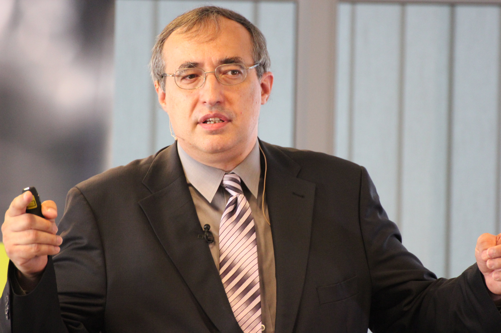
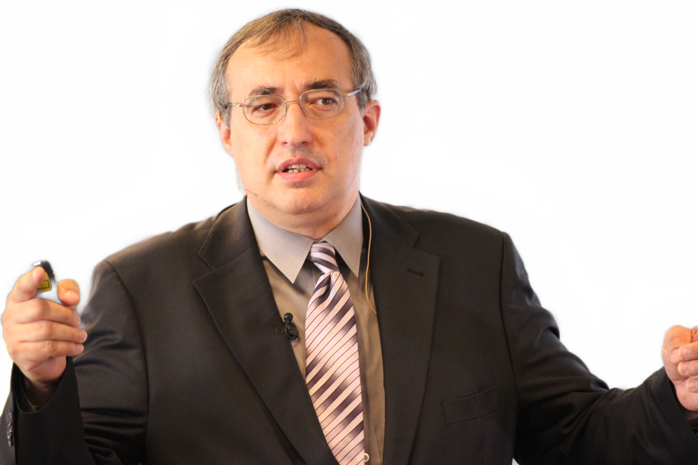

# BackgroundRemovalByModNet4OpenCV
Background Removal by ModNet in the pure OpenCV

 

This project reproduces two models for background removal distributed 
at https://github.com/ZHKKKe/MODNet under 
Creative Commons Attribution NonCommercial ShareAlike 4.0 license, 
i.e. for non-commercial purposes only

The original models are in the pytorch .ckpt format and cannot be loaded to OpenCV.
Here they are offered in .onnx format (version 9) with a demo source code, tested with OpenCV 4.5.

<a href="http://www.agentspace.org/download/modnet_webcam_portrait_matting_opset9.onnx" download>Download onnx model for the web camera</a>

<a href="http://www.agentspace.org/download/modnet_photographic_portrait_matting_opset9.onnx" download>Download onnx model for photos</a>

The demo source code is free.
